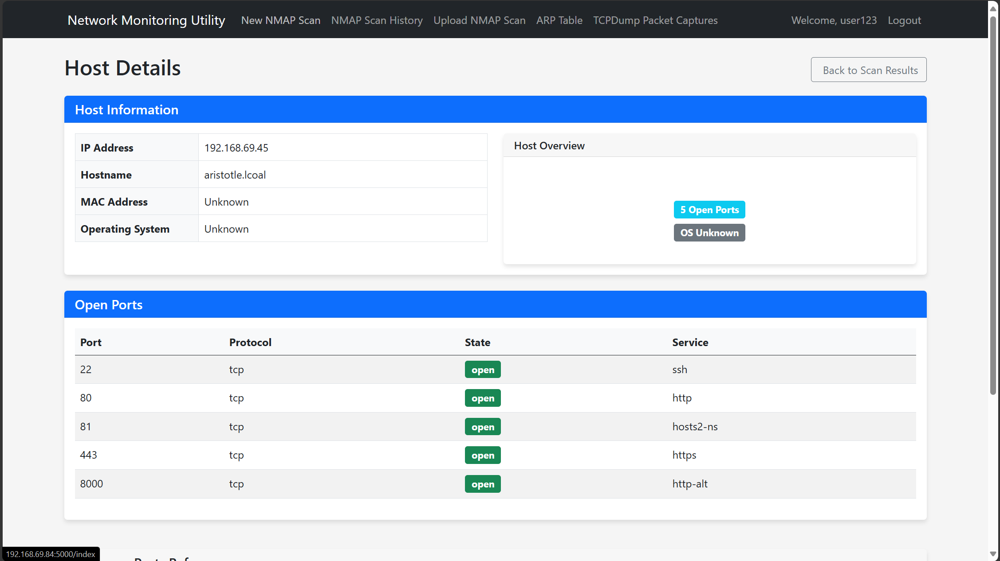
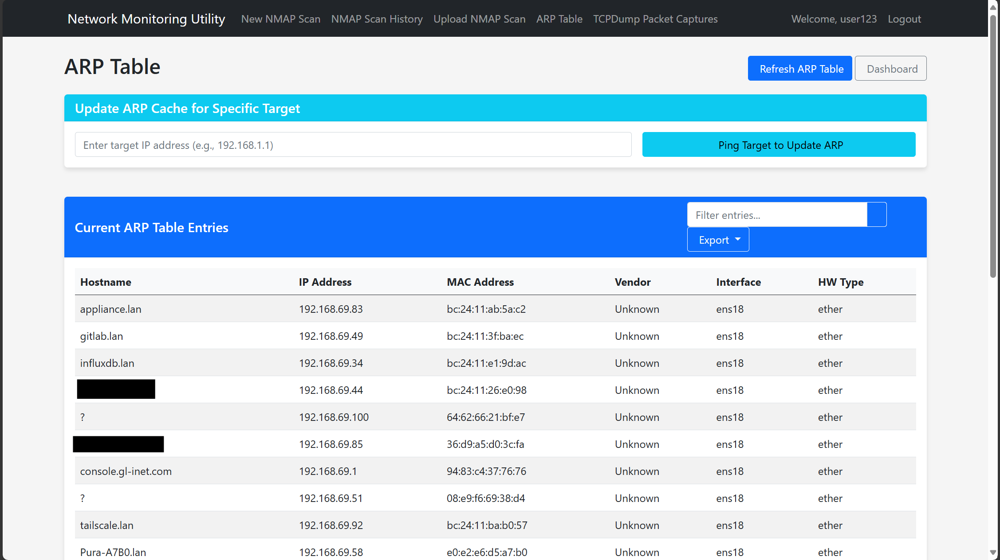
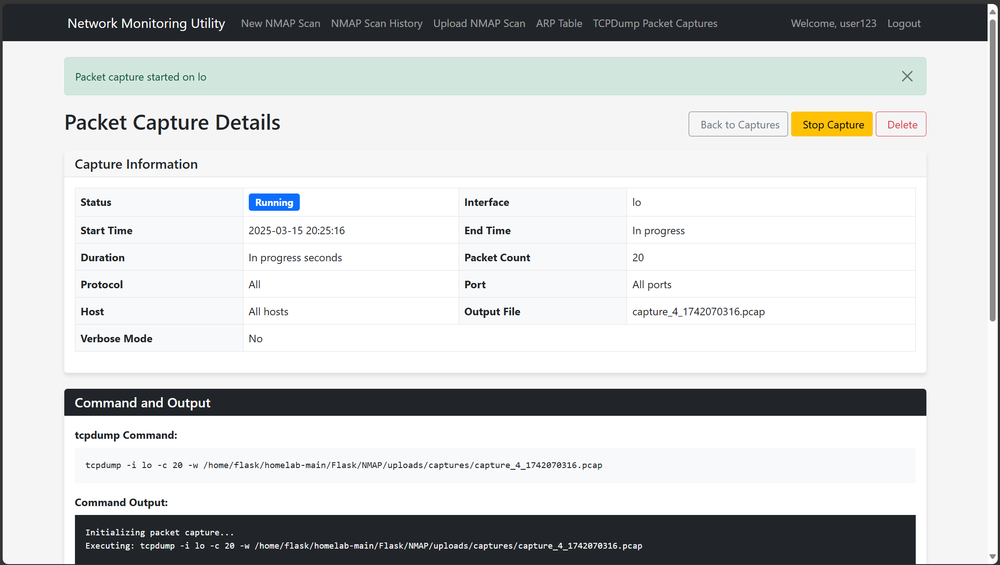

# Network Monitoring Utility

A comprehensive web-based network monitoring and analysis tool built with Flask.

## Core Features

### 🔍 NMAP Network Scanning
- Multiple scan types (simple, comprehensive, OS detection, service version)
- Real-time scan monitoring and visualized results
- Searchable scan history and detailed host information



### 📋 ARP Table Management
- Complete view of your network's ARP cache with vendor identification
- Active cache manipulation with targeted ping functionality
- Export capabilities for documentation and analysis



### 📊 TCPDump Packet Capture
- Intuitive interface for configuring and executing packet captures
- Protocol, port, and host filtering options
- PCAP file generation and download for analysis in Wireshark



### 🛠️ Network Diagnostic Tools
- **Ping**: Test connectivity with customizable packet count and interval settings
- **Traceroute**: Visualize network paths with detailed hop information
- **DNS Lookup (dig)**: Query and analyze DNS records with formatted results
- **iPerf3**: Measure network bandwidth performance with real-time graphs
- **Cross-tool integration** for comprehensive network analysis

### 🌓 UI Enhancements
- Dark mode support for reduced eye strain during extended use
- Responsive design for desktop and mobile usage
- Intuitive data visualization for all network tools

## Quick Start
1. Ensure all dependencies are installed
2. Clone this repo
   - `git clone https://github.com/GDRimmer/network-monitoring-utility.git`
   - `cd network-monitoring-utility`
3. Setup the database
   - `python create_db.py`
5. Run the application
   - `python run.py`
7. Access the web UI at http://<your_IP_address>:5000
8. Create an account

## Core Components

1. Application Setup and Configuration
- `__init__.py`: Main Flask application initialization
- `config.py`: Configuration settings for the application
- `create_db.py`: Database initialization script
- `run.py`: Application entry point

2. User Authentication
- `auth.py`: User login, registration, and authentication
- User model with secure password handling

3. NMAP Scanning Module
- **Controllers**:
  - `main.py`: Contains routes for NMAP scanning functionality
  - Supports starting, monitoring, and viewing scan results

- **Models**:
  - `Scan`: Stores scan configurations and results
  - `Host`: Discovered hosts from scans
  - `Port`: Open ports on discovered hosts

- **Supporting Components**:
  - `scanner.py`: Core NMAP integration and result parsing
  - `utils.py`: Helper functions for sanitizing inputs and generating visualizations
  - `test_nmap.py`: Testing script for NMAP functionality

4. ARP Table Module
- **Controllers**:
  - Routes in `main.py` for ARP table management
  - Support for viewing, refreshing, and exporting ARP data

- **Supporting Components**:
  - `utils_arp.py`: Functions for interacting with the system's ARP cache
  - MAC vendor database for identifying device manufacturers

5. Packet Capture Module
- **Controllers**:
  - Routes in `main.py` for packet capture operations
  - Support for starting, stopping, and downloading captures

- **Models**:
  - `PacketCapture`: Stores capture configurations and metadata

- **Supporting Components**:
  - `utils_tcpdump.py`: Functions for running tcpdump in the background
  - Management of capture processes and files

6. Network Tools Module
- **Controllers**:
  - Routes in `main.py` for network diagnostic tools
  - Support for executing commands and displaying results

- **Models**:
  - Generic command model for storing network tool operations

- **Views**:
  - Tool-specific interfaces (`network-ping-fix-updated.html`, `network-traceroute-fix-updated.html`, etc.)
  - Data visualization templates for analysis results

7. User Interface
- **Templates**:
  - `base.html`: Base template with navigation and dark mode toggle
  - NMAP-related views: `index.html`, `scan_results.html`, `scan_history.html`, etc.
  - ARP-related views: `arp_table.html`
  - TCPDump-related views: `packet_captures.html`, `capture_details.html`
  - Network tool views: Various tool-specific templates with visualization

- **Static Assets**:
  - `style.css`: Custom styling
  - `dark-mode.css`: Styling for dark mode
  - `main.js`: Client-side functionality
  - `dark-mode.js`: Dark mode toggle functionality

## Database Schema

1. **User**
   - Authentication information
   - Relationship to scans and captures

2. **Scan**
   - Target, scan type, arguments
   - Status and timestamps
   - Result data and command output
   - Relationship to discovered hosts

3. **Host**
   - IP address, hostname, MAC address, OS
   - Relationship to discovered ports

4. **Port**
   - Port number, protocol, service, state
   - Relationship to host

5. **PacketCapture**
   - Interface, protocol filters, host/port filters
   - Status and timestamps
   - Capture file metadata

6. **NetworkCommand**
   - Command type, arguments, status
   - Timestamps and duration
   - Command output and result data

## File Management

- Upload directory for scan results and capture files
- Secure file naming and access control
- Support for downloading capture files

## Security Features

- Input sanitization for command arguments
- Access control based on user ownership
- Secure password storage
- Protection against malicious command arguments

## Roadmap

- Network traffic visualization dashboard
- Scheduled scanning capabilities
- Real-time network anomaly detection
- Expanded protocol analysis tools
- REST API for integration with other security tools
- Support for additional network diagnostic tools

## Requirements

### System Requirements
- Linux-based OS (Ubuntu, Debian, CentOS, etc.)
- Root access for certain functionality (ARP table manipulation, packet captures)

### Core Dependencies
- Python 3.8+
- NMAP 7.80+
- TCPDump 4.9+
- Redis server (for Celery task queue)
- dig (DNS utils)
- iPerf3
- traceroute
- ping

### Sudo Configuration
The following tools require elevated privileges and need to be configured in the sudoers file for passwordless execution by the web application user (e.g., www-data, apache, or nginx):

1. Create a sudo configuration file:
```bash
sudo visudo -f /etc/sudoers.d/network-utility
```

2. Add the following lines to the file (replace `www-data` with your web server user):
```
# Allow www-data to run NMAP without password
www-data ALL=(ALL) NOPASSWD: /usr/bin/nmap

# Allow www-data to run TCPDump without password
www-data ALL=(ALL) NOPASSWD: /usr/sbin/tcpdump

# Allow www-data to access ARP table
www-data ALL=(ALL) NOPASSWD: /usr/sbin/arp
www-data ALL=(ALL) NOPASSWD: /usr/bin/ip neigh show
www-data ALL=(ALL) NOPASSWD: /usr/bin/ip neigh flush

# Allow www-data to run ping without password
www-data ALL=(ALL) NOPASSWD: /usr/bin/ping

# Allow www-data to run traceroute without password
www-data ALL=(ALL) NOPASSWD: /usr/bin/traceroute

# Allow www-data to run dig without password
www-data ALL=(ALL) NOPASSWD: /usr/bin/dig

# Allow www-data to run iPerf3 without password
www-data ALL=(ALL) NOPASSWD: /usr/bin/iperf3
```

3. Set proper permissions on the sudo configuration file:
```bash
sudo chmod 440 /etc/sudoers.d/network-utility
```

4. Verify the configuration:
```bash
sudo visudo -c
```

### Python Package Requirements
```
# Core Framework
Flask==2.0.1
Flask-Login==0.5.0
Flask-Migrate==3.1.0
Flask-SQLAlchemy==2.5.1
Flask-WTF==0.15.1
Werkzeug==2.0.1
# Database
SQLAlchemy==1.4.23
alembic==1.7.1
# Task Queue (for background processing)
celery==5.1.2
redis==3.5.3
# Network Tools Integration
python-nmap==0.7.1
netifaces==0.11.0
# Form Handling and Validation
WTForms==2.3.3
email-validator==1.1.3
# Security
werkzeug==2.0.1
# Other Utilities
Pillow==8.3.1  # For image processing (network maps)
uuid==1.30
```

## License

This project is licensed under the MIT License - see the [LICENSE](LICENSE) file for details.

## Acknowledgments

- [Claude](https://claude.ai/) for powerful coding support
- [NMAP](https://nmap.org/) for the powerful network scanning capabilities
- [TCPDump](https://www.tcpdump.org/) for packet capture functionality
- [Flask](https://flask.palletsprojects.com/) for the web framework
- Various open-source network diagnostic tools
